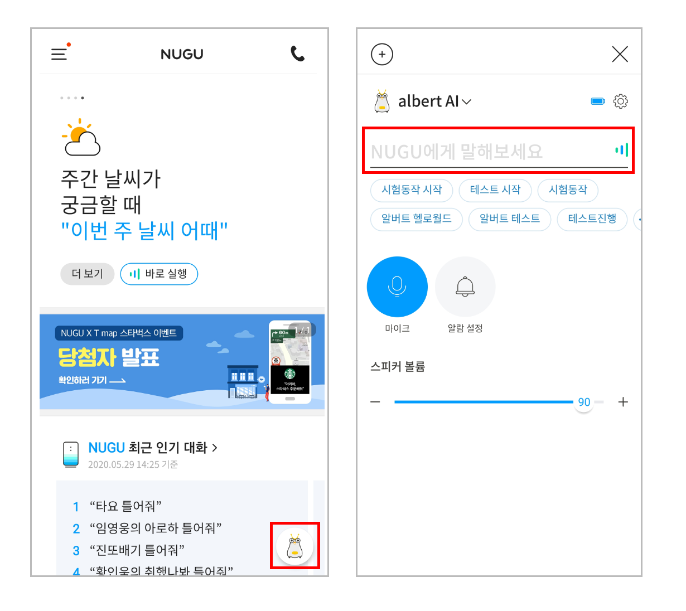

# Mobile App에서 명령(질문)을 직접하기
Mobile App을 통해 ‘텍스트 명령’을 이용할 수 있습니다. albert AI 디바이스에 직접 음성명령을 내리는 것과 동일한 효과와 결과를 보여줍니다.

디바이스 컨트롤러 특징
---
- NUGU 앱의 디바이스 컨트롤러 메뉴를 사용하여 텍스트 명령(질문)을 할 수 있습니다.
- 텍스트 명령을 요청하게되면 디바이스에서 곧바로 결과를 재생하며, 텍스트 명령 이력이 모바일앱에 표시됩니다.
- 텍스트명령을 활용하여 음성명령시 소요되는 음성호출(웨이크업)과 인식과정을 건너뛰고 빠르게 결과를 확인할 수 있습니다. 

사용방법
---
- albert AI 디바이스가 연결된 경우, 홈 화면 오른쪽 하단에 디바이스 모양의 플로팅 아이콘이 노출됩니다.
- 플로팅 아이콘을 터치하면 NUGU 디바이스의 주요 설정을 컨트롤 할 수 있는 ‘디바이스 컨트롤러’가 열립니다. 
- 화면 상단의 텍스트 명령 입력창에 명령(질문)을 입력하고 전달 버튼을 눌러 사용할 수 있습니다. 
- 최근 이용한 텍스트 명령 리스트를 확인하거나 재이용 할 수 있고, 자주 이용하는 명령어를 즐겨찾기로 설정할 수 있습니다.

